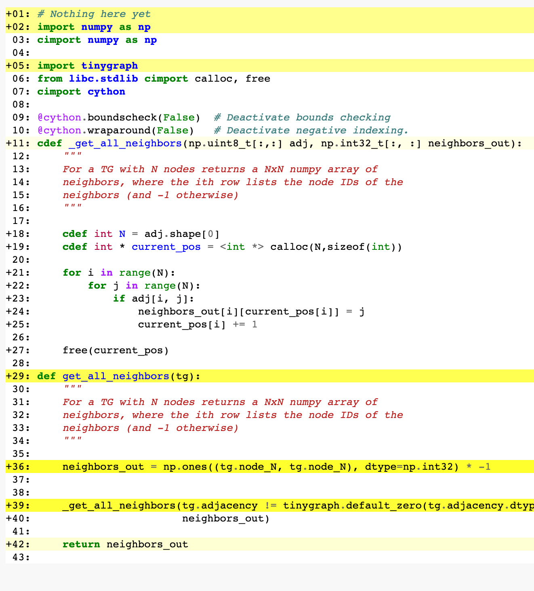

This is a tutorial on how we can optimize and cythonize some of our
algorithms. Cython is powerful but there's an annoying amount
of old or out-of-date information on the web about it. Additionally
there are various compilation (etc) tricks that can take HOURS
to get right if you don't know what you're looking for. 

## Step 1: Benchmark

We'd like to speed up our `algorithms.get_connected_components` function. 
The first thing we need to do is write a stand-alone benchmark, which
can be called from the command line. I modified one of the unit tests
and created `benchmark_cc.py`. 

It turns out that the graphs in the graph test suite are not terribly
representative of the kinds of graphs we might encounter in the real
world. This shouldn't be terribly surprising because there are a _lot_
of possible distributions over graphs. So instead we're going to
generate random 128-node graphs with an edge probability of 0.02. This
should result in a reasonable distribution of the number of
components. Note that *in general this is not sufficient*, and we'd
want to test many more corner cases. We might optimize the code for
graphs with a small number of components but it could be *far worse*
for a large number! 

To start out, we have the following performance:
```
% python benchmark_cc.py
average number of nodes: 128.0
average number of components: 12.05
average runtime: 1.4310050010681152 ms
```

Now we'll use [Line profiler](https://github.com/pyutils/line_profiler) to 
profile our code. For the function we care about (`get_connected_components`), we'll decorate it
with `@profile`:

```
@profile
def get_connected_components(tg):
    """
    Get a list of the connected components in the TinyGraph instance.
```

Then we run our code under line_profiler and look at the results. Note that `line_profiler` adds
a little bit of overhead so our results will be slower, but this will let us see where our time 
is going:


```
(s2s) jonas@coherence docs % python -m line_profiler benchmark_cc.py.lprof
Timer unit: 1e-06 s

Total time: 0.283071 s
File: /Users/jonas/projects/tinygraph/tinygraph/algorithms.py
Function: get_connected_components at line 6

Line #      Hits         Time  Per Hit   % Time  Line Contents
==============================================================
     6                                           @profile
     7                                           def get_connected_components(tg):
     8                                               """
     9                                               Get a list of the connected components in the TinyGraph instance.
    10
    11                                               Inputs:
    12                                                   tg (TinyGraph): graph to find components of.
    13
    14                                               Outputs:
    15                                                   cc ([{int}]): A list of connected components of tg, where each connected
    16                                                       component is given by a set of the nodes in the component.
    17                                               """
    18                                               # Track which nodes have not been visited yet, and keep a set with all of
    19                                               # the connected components.
    20       100        640.0      6.4      0.2      unseen = set(range(tg.node_N))
    21       100         54.0      0.5      0.0      components = []
    22      1343        399.0      0.3      0.1      while unseen:
    23                                                   # While there are still unvisited nodes, start from an unvisited node
    24                                                   # and explore its connected component.
    25      1243        534.0      0.4      0.2          comp = set()
    26      1243        549.0      0.4      0.2          bfs = set()
    27      1243        529.0      0.4      0.2          for start in unseen:
    28      1243        364.0      0.3      0.1              break
    29      1243        487.0      0.4      0.2          bfs.add(start)
    30     14043       4397.0      0.3      1.6          while bfs:
    31                                                       # Explore a new node in the connected component, adding it to the
    32                                                       # connected component set and adding its neighbors to the set to
    33                                                       # explore next.
    34     12800       4940.0      0.4      1.7              current = bfs.pop()
    35     12800       6555.0      0.5      2.3              unseen.remove(current)
    36     12800       4449.0      0.3      1.6              comp.add(current)
    37     45202     237497.0      5.3     83.9              for n in tg.get_neighbors(current):
    38     32402      14711.0      0.5      5.2                  if n in unseen:
    39     16201       6422.0      0.4      2.3                      bfs.add(n)
    40                                                   # Add this connected component to the set of connected components.
    41      1243        512.0      0.4      0.2          components.append(comp)
    42       100         32.0      0.3      0.0      return components
    
    
```

We can see right now that almost all of our time is being spent in
get_neighbors, and we're calling it a lot. Perhaps precomputing the neighbors might help? 
Always try and optimize in python first. 

```
Total time: 0.274835 s
File: /Users/jonas/projects/tinygraph/tinygraph/algorithms.py
Function: get_connected_components at line 6

Line #      Hits         Time  Per Hit   % Time  Line Contents
==============================================================
     6                                           @profile
     7                                           def get_connected_components(tg):
     8                                               """
     9                                               Get a list of the connected components in the TinyGraph instance.
    10
    11                                               Inputs:
    12                                                   tg (TinyGraph): graph to find components of.
    13
    14                                               Outputs:
    15                                                   cc ([{int}]): A list of connected components of tg, where each connected
    16                                                       component is given by a set of the nodes in the component.
    17                                               """
    18
    19                                               # precompute neighbor list
    20
    21       100     197928.0   1979.3     72.0      neighbors = [tg.get_neighbors(n) for n in range(tg.node_N)]
    22
    23                                               # Track which nodes have not been visited yet, and keep a set with all of
    24                                               # the connected components.
    25       100        515.0      5.2      0.2      unseen = set(range(tg.node_N))
    26       100         61.0      0.6      0.0      components = []
    27      1326        509.0      0.4      0.2      while unseen:
    28                                                   # While there are still unvisited nodes, start from an unvisited node
    29                                                   # and explore its connected component.
    30      1226        577.0      0.5      0.2          comp = set()
    31      1226        604.0      0.5      0.2          bfs = set()
    32      1226        607.0      0.5      0.2          for start in unseen:
    33      1226        475.0      0.4      0.2              break
    34      1226        552.0      0.5      0.2          bfs.add(start)
    35     14026       5274.0      0.4      1.9          while bfs:
    36                                                       # Explore a new node in the connected component, adding it to the
    37                                                       # connected component set and adding its neighbors to the set to
    38                                                       # explore next.
    39     12800       5780.0      0.5      2.1              current = bfs.pop()
    40     12800       7618.0      0.6      2.8              unseen.remove(current)
    41     12800       5524.0      0.4      2.0              comp.add(current)
    42     44812      25504.0      0.6      9.3              for n in neighbors[current]:
    43     32012      15592.0      0.5      5.7                  if n in unseen:
    44     16006       7147.0      0.4      2.6                      bfs.add(n)
    45                                                   # Add this connected component to the set of connected components.
    46      1226        535.0      0.4      0.2          components.append(comp)
    47       100         33.0      0.3      0.0      return components
    
```

Note that precomputing the neighbors helps a little bit but we're still
spending a lot of time in that call. Let's make a function that just
computes the neighbors for all nodes in a graph. Since it will involve
a for loop (which is traditionally slow in python) and there's no
easy efficient NumPy way to do it, we can do it in Cython. 

Note due to [Ahmdel's law](https://en.wikipedia.org/wiki/Amdahl%27s_law) 
even if we could make function take 0 time, our code would still only get
~3 times faster. It's important to have reasonable expectations
about any particular piece of optimization. 

## Cython function first pass

If you're not familiar with Cython, it's a little mini-language that
is very python-like but compiles to C/C++ so that you can get tremendous
speed. It also makes it easy to call into existing C/C++ libraries. 

Tutorial material:
* Cython basics
* [Your first cython program](https://cython.readthedocs.io/en/latest/src/userguide/numpy_tutorial.html#the-first-cython-program) : Shows how to add types and optimize the code. 
* [Cython with numpy and typed memoryviews](https://cython.readthedocs.io/en/latest/src/userguide/numpy_tutorial.html#numpy-tutorial)

We'll add it to `fastutils.pyx` which is a Cython file we have already 
integrated into our build system. 

The one annoying thing about Python extensions is that `pip install -e`
no longer works, and we actually have to install the module with
```
python setup.py install
```
We now have to do this every time we make a change to our code. Oh the
pains of compiled code!

Here's our fist crack at a function in cython: 

```
def get_all_neighbors(tg):
    """
    For a TG with N nodes returns a NxN numpy array of
    neighbors, where the ith row lists the node IDs of the 
    neighbors (and -1 otherwise)
    """
    
    neighbors_out = np.ones((tg.node_N, tg.node_N), dtype=np.int16) * -1
    
    for n in range(tg.node_N):
        neighbors = tg.get_neighbors(n)
        neighbors_out[n, :len(neighbors)] = neighbors

    return neighbors_out

```

Let's check out our performance:
```
Line #      Hits         Time  Per Hit   % Time  Line Contents
==============================================================
     7                                           @profile
     8                                           def get_connected_components(tg):
     9                                               """
    10                                               Get a list of the connected components in the TinyGraph instance.
    11
    12                                               Inputs:
    13                                                   tg (TinyGraph): graph to find components of.
    14
    15                                               Outputs:
    16                                                   cc ([{int}]): A list of connected components of tg, where each connected
    17                                                       component is given by a set of the nodes in the component.
    18                                               """
    19
    20                                               # precompute neighbor list
    21
    22       100     202425.0   2024.2     67.5      neighbors = tinygraph.fastutils.get_all_neighbors(tg)
    23
    24                                               # Track which nodes have not been visited yet, and keep a set with all of
    25                                               # the connected components.
    26       100        494.0      4.9      0.2      unseen = set(range(tg.node_N))
    27       100         57.0      0.6      0.0      components = []
    28      1315        433.0      0.3      0.1      while unseen:
    29                                                   # While there are still unvisited nodes, start from an unvisited node
    30                                                   # and explore its connected component.
    31      1215        458.0      0.4      0.2          comp = set()
    32      1215        531.0      0.4      0.2          bfs = set()
    33      1215        474.0      0.4      0.2          for start in unseen:
    34      1215        358.0      0.3      0.1              break
    35      1215        438.0      0.4      0.1          bfs.add(start)
    36     14015       3913.0      0.3      1.3          while bfs:
    37                                                       # Explore a new node in the connected component, adding it to the
    38                                                       # connected component set and adding its neighbors to the set to
    39                                                       # explore next.
    40     12800       4760.0      0.4      1.6              current = bfs.pop()
    41     12800       4112.0      0.3      1.4              unseen.remove(current)
    42     12800       4287.0      0.3      1.4              comp.add(current)
    43     45354      17964.0      0.4      6.0              for n_i in range(tg.node_N):
    44     45354      24720.0      0.5      8.2                  n = int(neighbors[current, n_i])
    45     45354      13910.0      0.3      4.6                  if n < 0:
    46     12800       3914.0      0.3      1.3                      break
    47     32554      10285.0      0.3      3.4                  if n in unseen:
    48     16277       5940.0      0.4      2.0                      bfs.add(n)
    49                                                   # Add this connected component to the set of connected components.
    50      1215        429.0      0.4      0.1          components.append(comp)
    51       100         29.0      0.3      0.0      return components
    
```


Oh no, it's not much faster! Why?

This is because our Cython function is still basically a pure Python funciton. The generated
C code still has to work with Python objects, handle refernece counting, and the like. Let's rewrite
it to take advantage of typing information (make sure to read ["Your first cython program"](https://cython.readthedocs.io/en/latest/src/userguide/numpy_tutorial.html#the-first-cython-program) to understand what's going on here. 

Our new faster Cython version is :

```
import numpy as np
cimport numpy as np

import tinygraph
from libc.stdlib cimport calloc, free
cimport cython

@cython.boundscheck(False)  # Deactivate bounds checking
@cython.wraparound(False)   # Deactivate negative indexing.
cdef _get_all_neighbors(np.uint8_t[:,:] adj, np.int32_t[:, :] neighbors_out):  
    """
    For a TG with N nodes returns a NxN numpy array of
    neighbors, where the ith row lists the node IDs of the 
    neighbors (and -1 otherwise)
    """
    
    cdef int N = adj.shape[0]
    cdef int * current_pos = <int *> calloc(N,sizeof(int))
    
    for i in range(N):
        for j in range(N):
            if adj[i, j]:
                neighbors_out[i][current_pos[i]] = j
                current_pos[i] += 1

    free(current_pos)

def get_all_neighbors(tg):  
    """
    For a TG with N nodes returns a NxN numpy array of
    neighbors, where the ith row lists the node IDs of the 
    neighbors (and -1 otherwise)
    """

    neighbors_out = np.ones((tg.node_N, tg.node_N), dtype=np.int32) * -1
    
    
    _get_all_neighbors(tg.adjacency != tinygraph.default_zero(tg.adjacency.dtype),
                       neighbors_out)

    return neighbors_out

```

Again, you should really read the cython and cython numpy tutorials so this makes sense. 
Be sure to note a few things:

- The cdef function can only be called from within cython
- Thus we have the regular `def`'d function that we can call from our module
- Note that inside the cdef'd function we use `calloc` to allocate memory. We can't
create python objects inside these c functions! 

Cython will sometimes error on the side of adding in python code; that is, if
you forget to specify the type of a variable, it will assume its a full
python object and generate very slow code. A great way to check this is by running

```
cython -a fastutils.pyx
```
which will generate a `fastutils.html` report you can look at. The report will
look as follows:



The "yellow" parts are where Cython generated code to work with Python objects. You will
note there is NO yellow shading on our `cdef`d function, meaning that we generated
pure C code which should be really fast! (Of course there are lines in the the `def`'d function
that are yellow, because they are working with python objects. In the actual
HTML report you can click on the "+" sign and see all the generated code. Yuk!


If we benchmark our code now we see:

```
Line #      Hits         Time  Per Hit   % Time  Line Contents
==============================================================
     7                                           @profile
     8                                           def get_connected_components(tg):
     9                                               """
    10                                               Get a list of the connected components in the TinyGraph instance.
    11
    12                                               Inputs:
    13                                                   tg (TinyGraph): graph to find components of.
    14
    15                                               Outputs:
    16                                                   cc ([{int}]): A list of connected components of tg, where each connected
    17                                                       component is given by a set of the nodes in the component.
    18                                               """
    19
    20                                               # precompute neighbor list
    21
    22       100       7363.0     73.6      6.5      neighbors = tinygraph.fastutils.get_all_neighbors(tg)
    23
    24                                               # Track which nodes have not been visited yet, and keep a set with all of
    25                                               # the connected components.
    26       100        600.0      6.0      0.5      unseen = set(range(tg.node_N))
    27       100         54.0      0.5      0.0      components = []
    28      1298        425.0      0.3      0.4      while unseen:
    29                                                   # While there are still unvisited nodes, start from an unvisited node
    30                                                   # and explore its connected component.
    31      1198        482.0      0.4      0.4          comp = set()
    32      1198        517.0      0.4      0.5          bfs = set()
    33      1198        516.0      0.4      0.5          for start in unseen:
    34      1198        423.0      0.4      0.4              break
    35      1198        520.0      0.4      0.5          bfs.add(start)
    36     13998       4290.0      0.3      3.8          while bfs:
    37                                                       # Explore a new node in the connected component, adding it to the
    38                                                       # connected component set and adding its neighbors to the set to
    39                                                       # explore next.
    40     12800       5027.0      0.4      4.4              current = bfs.pop()
    41     12800       4482.0      0.4      3.9              unseen.remove(current)
    42     12800       4641.0      0.4      4.1              comp.add(current)
    43     45550      19403.0      0.4     17.0              for n_i in range(tg.node_N):
    44     45550      27467.0      0.6     24.1                  n = int(neighbors[current, n_i])
    45     45550      15331.0      0.3     13.4                  if n < 0:
    46     12800       4233.0      0.3      3.7                      break
    47     32750      11015.0      0.3      9.7                  if n in unseen:
    48     16375       6797.0      0.4      6.0                      bfs.add(n)
    49                                                   # Add this connected component to the set of connected components.
    50      1198        473.0      0.4      0.4          components.append(comp)
    51       100         32.0      0.3      0.0      return components
    
```

Wow that's way faster! 

Per usual, we should check and make sure that it works properly by running our unit tests. 

Unfortunately now, most of the time is being spent inside the inner loop. How might we speed this up? 
Perhaps we should try making the entire function in Cython! 

## Cython function two 

Now let's try a relatively straight-forward translation of our `get_connected_components` function
into Cython. Note that `line_profiler` sadly cannot see inside of cython functions, so we'll remove our
`profile` decorator and go back to just comparing our end-to-end benchmarks. 

After our improvement above, we see:
```
% python benchmark_cc.py
average number of nodes: 128.0
average number of components: 11.57
average runtime: 0.27662038803100586 ms
```

which is about 4x faster. Can we do better? 

When trying to write the pure Cython versio of the code, we run into a
hitch: we make extensive use of sets, which are a Python object. There
are a few ways we can handle this:

1. Directly copy the function over and hope enough of the non-python parts can be accelerated
to make it worthwhile. Cython will happily generate code to work with python sets, they
just come with all the associated overhead of working with python objects. 
2. Use a data structure from the C++ standard library, like `std::set`. If you know C++ this
can be a pretty efficient way to go. 
3. See if there's a way around using the Python data structure. 

Let's start trying #1, we'll copy it over and use cython's `cpdef` function that
tries to create a fast function you can call from both c and Python. This yields
a speedup too!

```
% python benchmark_cc.py
average number of nodes: 128.0
average number of components: 11.62
average runtime: 0.19039630889892578 ms
```

33% faster for copying and pasting code! But we can do better. We'll
use option three, in particular since our sets track node IDs we can
replace them with an array of size N. A true value in this array means
that the node at that index is in the set.

```
% python benchmark_cc.py
average number of nodes: 128.0
average number of components: 12.22
average runtime: 0.1161956787109375 ms
```
